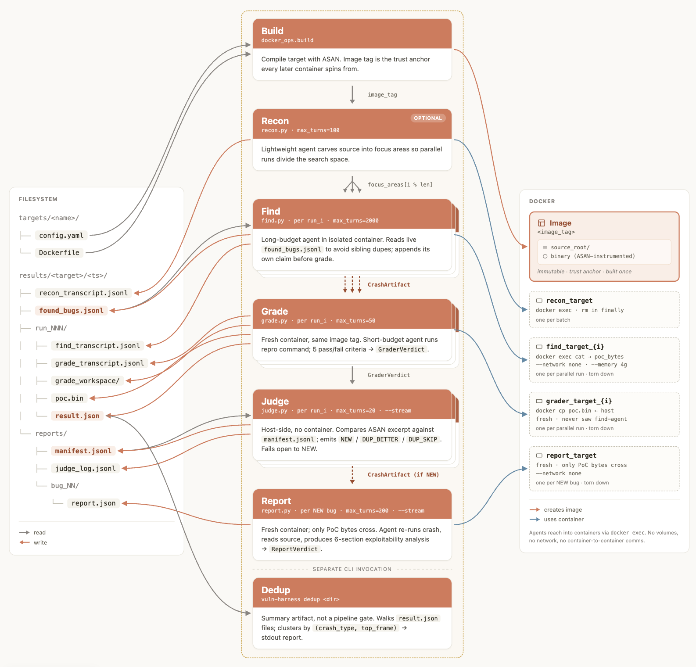

# The reference pipeline: deep dive

The reference pipeline is an autonomous, multi-agent pipeline for finding memory
vulnerabilities in C/C++ codebases. It runs fully autonomously, does dynamic
analysis (ASAN-instrumented execution), and layers deduplication, judging,
and exploitability reporting on top of the core recon → find → verify loop.

> ⚠️ **The pipeline executes target code.** Requires Docker. Run it inside a
> strong isolation layer; see [security.md](security.md) before scaling up.

## Install and first run

```bash
# Initialize environment
python3 -m venv .venv
.venv/bin/pip install -e .
export ANTHROPIC_API_KEY=sk-ant-...   # or CLAUDE_CODE_OAUTH_TOKEN

# One-time: install gVisor, build the shared agent image, verify isolation
./scripts/setup_sandbox.sh

# Map the target (prints focus_areas YAML)
bin/vp-sandboxed recon drlibs --model <model-id>

# Full pipeline: small first wave to calibrate token burn
bin/vp-sandboxed run drlibs --model <model-id> --runs 3 --parallel --stream
```

The pipeline auto-builds an ASAN-instrumented Docker image per target
(`targets/<target>/Dockerfile`), then runs find/grade/judge/report agents
against it. Results land in `results/<target>/<timestamp>/`; with `--stream`,
the first exploitability report typically appears in minutes under
`reports/bug_NN/`.

> **Watching an agent mid-run:** each find-agent is a headless Claude Code
> session inside its own container; the orchestrator streams its transcript
> to `results/<target>/<ts>/run_NNN/{find,grade,recon,report}_transcript.jsonl`
> as messages arrive. Tailing that JSONL and filtering for `"type":"tool_use"`
> shows you exactly what the agent is trying; useful when iterating on prompts.

**Drive it from Claude Code the first time.** A `CLAUDE.md` ships with the
repo to orient Claude on how to run each phase and what to watch for.
Stepping through interactively gives you a feel for what the agents are
doing, where tokens go, and whether the pipeline is tuned for your target
before you scale up. Even once you've moved to autonomous runs, launching
them in the background from a Claude Code session makes it easy to tail
transcripts, inspect findings mid-run, and stop early without losing
anything.

## Architecture



**Build.** Builds the target container image (automatic, per-target
Dockerfile).

**Recon** (optional). An agent reads the source tree and proposes a
partition: "here are 8 distinct parsers worth attacking separately." Gives
parallel runs different starting points instead of all converging on the same
shallow bug. Skip it if you've hand-written `focus_areas:` in the target
config.

**Find.** The core loop. An agent in a network-isolated container reads
source, crafts malformed inputs, runs the ASAN binary, and iterates until a
crash reproduces 3/3. Output is the crashing input file, not a prose report.
Run N in parallel; agents append raw ASAN excerpts to a shared crash log as
they go, so later agents can avoid re-finding what earlier ones already hit.

**Grade.** A second agent, in a fresh container the find agent never touched,
verifies the PoC reproduces, is in project code, and isn't just an OOM. Only
the PoC bytes cross between containers. Flaky-but-real crashes (races,
heap-layout-dependent) can PASS with a lower score.

**Judge** (`--stream` only). A short, no-tools agent (run in its own sandbox
container like every other phase) reads the graded crash against the existing
bug manifest and decides: new bug (write a report), cleaner duplicate of an
existing one (re-report, then compare), or skip.
Replaces regex signature-match as the report gate. Serialized so two
simultaneous arrivals don't both claim "new" for the same root cause.

**Report.** A structured exploitability analysis per unique bug: precise
primitive characterization, reachability from the real attack surface, heap
layout, escalation-path sketch, mitigation constraints, and an agent-judged
severity. Scored by a separate grader agent (semantic rubric, not keyword
scan). Optional `--novelty` adds a host-side upstream `git log` check so the
report can state FIXED/UNFIXED; off by default so nothing touches the network
unless asked. With `--stream`, the first report lands in minutes; without it,
run `vuln-pipeline report results/<target>/<ts>/` after the batch completes.

**Dedup.** Post-hoc summary: "these N crashes cluster into M signatures." Not
a phase gate; the judge decides what gets reported.

## CLI reference

```bash
vuln-pipeline recon  <target> --model <m>           # propose focus_areas (YAML → stdout)
vuln-pipeline run    <target> --model <m>           # find + grade, one run
vuln-pipeline run    <target> --runs N --parallel   # N concurrent finds
vuln-pipeline run    <target> --auto-focus          # recon first, use its partition
vuln-pipeline run    <target> --stream              # judge+report stream as grades land (recommended)
vuln-pipeline run    <target> --find-only           # skip grade (prompt iteration)
vuln-pipeline run    <target> --engagement-context <file>  # org-specific auth block
vuln-pipeline run    <target> --resume <dir>        # continue a partially-killed batch
vuln-pipeline dedup  results/<target>/<ts>/         # group crashes by signature
vuln-pipeline report results/<target>/<ts>/         # batch-mode exploitability analysis (skips done)
vuln-pipeline report results/<target>/<ts>/ --fresh # ignore report.json checkpoints
vuln-pipeline patch  results/<target>/<ts>/         # generate + verify a fix per crash (see patching.md)
```

A killed orchestrator leaves per-run `result.json` files on disk;
`--resume <dir>` reads those, skips terminal runs, and retries
`agent_failed`/`error`. `report` likewise skips any `bug_NN/report.json` that
already landed with `status: report_submitted`. See
[troubleshooting.md#pipeline-resume](troubleshooting.md#pipeline-resume).

## Design principles

In short, the essential steps of an effective vulnerability-finding pipeline:

1. Build the target.
2. Spin up N agents to search for vulnerabilities.
3. Grade the findings.

We've found it most effective to break this into modular steps, each of which
saves its progress durably, and over time we've added more steps like
de-duplication, report writing, and so on. A Docker container image is a
great way to store a reusable build artifact and provides an environment in
which exploits can be attempted safely. Vulnerability-finding agents should
store their results in a standard format which can be verified by graders.
These agents can decide their own exploration path from the beginning, or you
can seed them with "focus areas" via a recon step. Graders should be able to
run over any findings multiple times as they're calibrated with human
feedback.

Aside from modularity, a critical component is an effective grader. The
grader must run as a separate agent with access to a clean sandbox in which
it can run any proofs of concept. It should be framed as an adversary
actively trying to disprove findings, which are guilty until proven innocent.
Proof-of-concept exploits that produce a witness are best, but not always
possible. The grader should also be tailored for the vulnerability types
under inspection: some bugs are proven by PoC, others by logical argument.
Skills or a lightweight routing layer to different verifiers may be good
approaches when multiple classes are in scope.

For recon-stage techniques that improve precision and coverage on large
or unfamiliar targets (file ranking, starting from the live app, feeding
observability data, tool provisioning), see
[best-practices.md](best-practices.md).

## Rate limits and resume-on-error

As a rough guideline, expect ~10K uncached input tokens/min and ~2K output
tokens/min per agent. This varies; compile+run time in different languages
throttles token consumption naturally. Scale parallelism to your account's
ITPM: roughly **10 agents per 100K ITPM** as a starting point (check your
limit in the [Claude Console](https://console.claude.com/settings/limits)).

That said, briefly bursting past your limit is not catastrophic. Each agent
is a single long-lived `claude -p` session; a 429 mid-run is handled at two
layers: the Claude CLI transparently retries the API call with its own
backoff, and if that exhausts, the pipeline backs off exponentially (cap 300s)
and relaunches with `--resume <session_id>`, restoring full conversation
history so the agent continues from the exact turn that failed. This repeats
up to 20× per agent before the run is marked failed, and even then the
partial transcript is preserved on disk. If you build your own pipeline,
replicate this; see `harness/agent.py` for the reference implementation.
